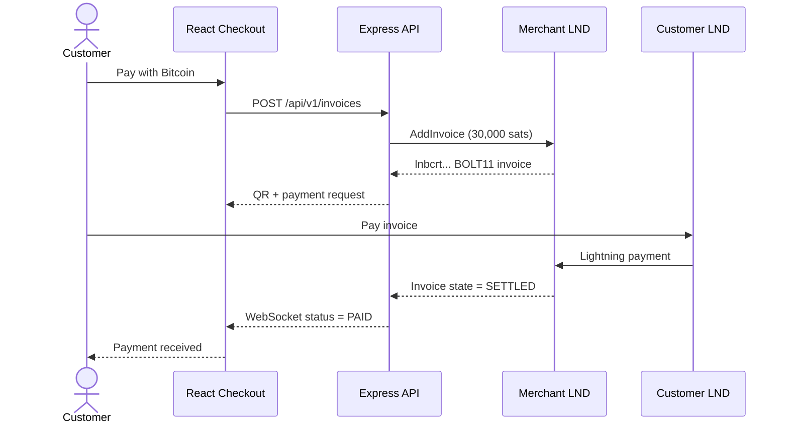

# Bitcoin Lightning E-commerce Payment Gateway


A learning project that demonstrates how an online store can create Bitcoin
Lightning invoices, display them as QR codes, detect settlement, and update a
customer's checkout in real time.

The project is being built step by step to understand the infrastructure behind
a non-custodial Bitcoin payment gateway. It is not production-ready and should
not currently be used to process customer money.

> Create invoice → show QR → pay from a Lightning wallet → detect LND settlement
> → update the checkout over WebSockets.

## Demo gallery


More screenshots can be added as the project grows:

<!--


-->

Recommended screenshots:

| Filename | What it should show |
|---|---|
| `storefront.png` | The shoe product, $20 total, and Pay with Bitcoin button |
| `lightning-checkout.png` | QR code, `lnbcrt...` request, amount, and countdown |
| `polar-network.png` | Bitcoin Core, Merchant LND, Customer LND, and their channels |
| `polar-payment.png` | Customer node paying the Merchant invoice |
| `payment-received.png` | React's successful Payment received state |

The storefront and Lightning checkout screenshots are included. After adding
any remaining files, move their image markup outside the `<!--` and `-->`
comment lines to display them on GitHub.

## What the project does

1. A customer selects a product in the React storefront.
2. React requests an invoice from the Node.js API.
3. The API asks the merchant's LND node to create a BOLT11 invoice.
4. The invoice is rendered as a QR code with a 15-minute countdown.
5. The backend monitors the invoice state in LND.
6. When LND reports `SETTLED`, the backend marks the order `PAID`.
7. A WebSocket message updates the React checkout immediately.

## Current project scope

This project currently implements a **Bitcoin Lightning checkout for receiving
customer payments**.

```text
Customer Lightning wallet
           │
           │ pays a BOLT11 invoice
           ▼
Merchant LND wallet
```

### Currently implemented

- Receive incoming Bitcoin payments over the Lightning Network.
- Create a unique BOLT11 invoice for an e-commerce order.
- Convert the `$20` product price to `30,000 sats` using a fixed
  learning-only rate.
- Display the Lightning invoice as a QR code and copyable payment request.
- Show a 15-minute invoice-expiration countdown.
- Check the invoice state through the Merchant LND node.
- Accept `SETTLED` as the only successful-payment state.
- Push the paid state to React using WebSockets.
- Demonstrate Merchant inbound and Customer outbound channel liquidity on
  regtest.
- Switch LND connectivity between regtest and mainnet using environment
  configuration.

### Not currently implemented

- Merchant payouts to customers, suppliers, or other wallets.
- Customer refunds.
- Sending Bitcoin from the Merchant wallet.
- On-chain Bitcoin checkout using `bc1...` or `bcrt1...` addresses.
- Withdrawals from LND to cold storage or an exchange.
- Automatic conversion between Bitcoin and fiat currency.
- Bank, card, stablecoin, or other cryptocurrency payments.
- Production merchant accounts, balances, or settlement reports.

### Why payouts are excluded

Receiving and spending require different security permissions. The backend uses
LND's restricted `invoice.macaroon`, which can manage invoices but is not given
general permission to spend the Merchant's funds. A payout system would require
separate authorization, approval rules, spending limits, idempotency, audit
logs, destination validation, and stronger operational security.

The accurate current project description is:

> A non-custodial Bitcoin Lightning checkout gateway for receiving customer
> payments, developed and tested end to end on regtest with a network-configurable
> LND integration.

```text
React storefront
      │
      │ HTTP + WebSocket
      ▼
Node.js / Express API
      │
      │ HTTPS + invoice macaroon
      ▼
Merchant LND node
      │
      ▼
Bitcoin + Lightning network
```



## Technology

- React 19 and Vite
- Node.js and Express
- WebSockets (`ws`)
- LND REST API
- BOLT11 Lightning invoices
- QR-code generation
- Node.js test runner
- Polar and Docker for local regtest development

PostgreSQL, merchant webhooks, live BTC/USD pricing, authentication, and payment
auditing are planned later steps.

