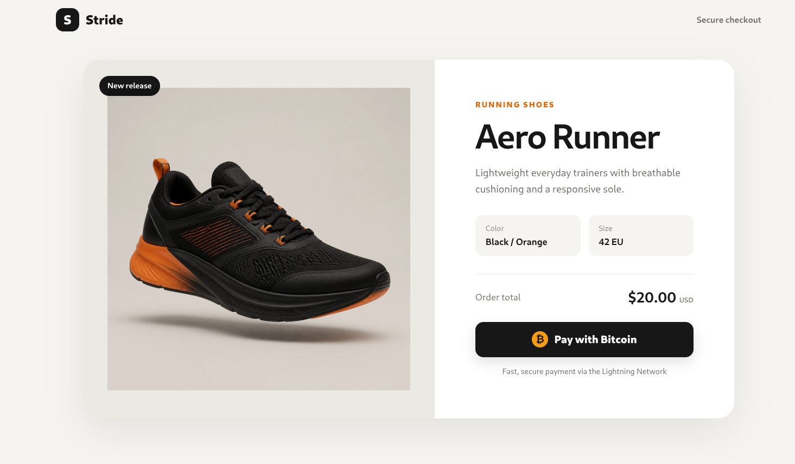
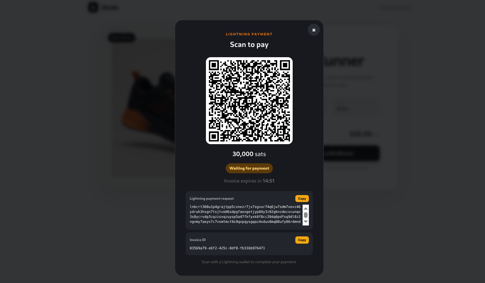
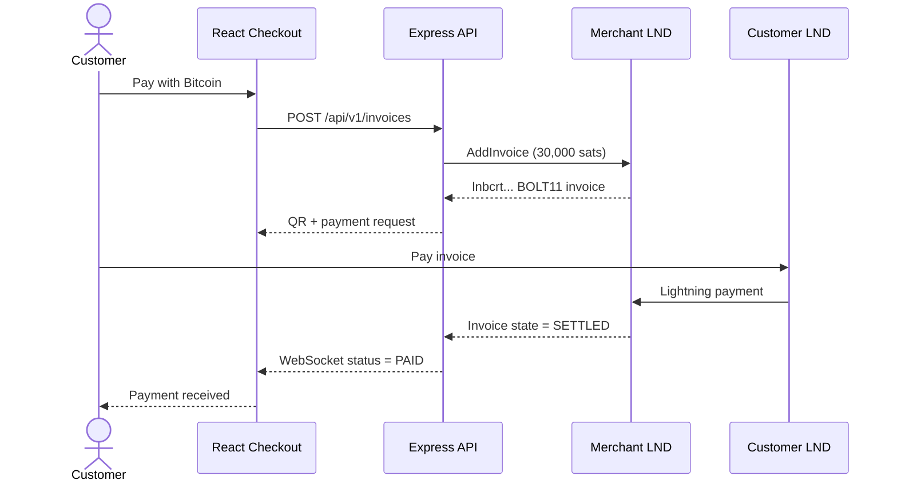

# Bitcoin Lightning E-commerce Payment Gateway


A learning project that demonstrates how an online store can create Bitcoin
Lightning invoices, display them as QR codes, detect settlement, and update a
customer's checkout in real time.

The project is being built step by step to understand the infrastructure behind
a non-custodial Bitcoin payment gateway. It is not production-ready and should
not currently be used to process customer money.

> Create invoice → show QR → pay from a Lightning wallet → detect LND settlement
> → update the checkout over WebSockets.

## Demo gallery





More screenshots can be added as the project grows:

<!--


-->

Recommended screenshots:

| Filename | What it should show |
|---|---|
| `storefront.png` | The shoe product, $20 total, and Pay with Bitcoin button |
| `lightning-checkout.png` | QR code, `lnbcrt...` request, amount, and countdown |
| `polar-network.png` | Bitcoin Core, Merchant LND, Customer LND, and their channels |
| `polar-payment.png` | Customer node paying the Merchant invoice |
| `payment-received.png` | React's successful Payment received state |

The storefront and Lightning checkout screenshots are included. After adding
any remaining files, move their image markup outside the `<!--` and `-->`
comment lines to display them on GitHub.

## What the project does

1. A customer selects a product in the React storefront.
2. React requests an invoice from the Node.js API.
3. The API asks the merchant's LND node to create a BOLT11 invoice.
4. The invoice is rendered as a QR code with a 15-minute countdown.
5. The backend monitors the invoice state in LND.
6. When LND reports `SETTLED`, the backend marks the order `PAID`.
7. A WebSocket message updates the React checkout immediately.

## Current project scope

This project currently implements a **Bitcoin Lightning checkout for receiving
customer payments**.

```text
Customer Lightning wallet
           │
           │ pays a BOLT11 invoice
           ▼
Merchant LND wallet
```

### Currently implemented

- Receive incoming Bitcoin payments over the Lightning Network.
- Create a unique BOLT11 invoice for an e-commerce order.
- Convert the `$20` product price to `30,000 sats` using a fixed
  learning-only rate.
- Display the Lightning invoice as a QR code and copyable payment request.
- Show a 15-minute invoice-expiration countdown.
- Check the invoice state through the Merchant LND node.
- Accept `SETTLED` as the only successful-payment state.
- Push the paid state to React using WebSockets.
- Demonstrate Merchant inbound and Customer outbound channel liquidity on
  regtest.
- Switch LND connectivity between regtest and mainnet using environment
  configuration.

### Not currently implemented

- Merchant payouts to customers, suppliers, or other wallets.
- Customer refunds.
- Sending Bitcoin from the Merchant wallet.
- On-chain Bitcoin checkout using `bc1...` or `bcrt1...` addresses.
- Withdrawals from LND to cold storage or an exchange.
- Automatic conversion between Bitcoin and fiat currency.
- Bank, card, stablecoin, or other cryptocurrency payments.
- Production merchant accounts, balances, or settlement reports.

### Why payouts are excluded

Receiving and spending require different security permissions. The backend uses
LND's restricted `invoice.macaroon`, which can manage invoices but is not given
general permission to spend the Merchant's funds. A payout system would require
separate authorization, approval rules, spending limits, idempotency, audit
logs, destination validation, and stronger operational security.

The accurate current project description is:

> A non-custodial Bitcoin Lightning checkout gateway for receiving customer
> payments, developed and tested end to end on regtest with a network-configurable
> LND integration.

```text
React storefront
      │
      │ HTTP + WebSocket
      ▼
Node.js / Express API
      │
      │ HTTPS + invoice macaroon
      ▼
Merchant LND node
      │
      ▼
Bitcoin + Lightning network
```



## Technology

- React 19 and Vite
- Node.js and Express
- WebSockets (`ws`)
- LND REST API
- BOLT11 Lightning invoices
- QR-code generation
- Node.js test runner
- Polar and Docker for local regtest development

PostgreSQL, merchant webhooks, live BTC/USD pricing, authentication, and payment
auditing are planned later steps.

## Official installation documentation

Use the official project documentation when installing or updating the tools:

| Tool | Why it is needed | Official documentation |
|---|---|---|
| Node.js and npm | Runs the React build tools and Express API | [Download Node.js](https://nodejs.org/en/download) |
| Docker Engine | Runs Polar's Bitcoin and Lightning containers | [Install Docker Engine](https://docs.docker.com/engine/install/) |
| Docker Compose | Manages the containers created by Polar | [Install Docker Compose](https://docs.docker.com/compose/install/) |
| Polar | Creates the private regtest network and managed nodes | [Polar website](https://lightningpolar.com/) and [Polar releases](https://github.com/jamaljsr/polar/releases) |
| Bitcoin Core | Provides the regtest Bitcoin blockchain | [Bitcoin Core downloads](https://bitcoincore.org/en/download/) |
| LND and `lncli` | Creates wallets, channels, invoices, and payments | [LND installation guide](https://docs.lightning.engineering/lightning-network-tools/lnd/run-lnd) |
| LND REST API | Defines the invoice endpoints used by the backend | [LND API reference](https://lightning.engineering/api-docs/api/lnd/) |
| React | Implements the customer checkout | [React documentation](https://react.dev/) |
| Vite | Runs and builds the React frontend | [Vite guide](https://vite.dev/guide/) |

For the recommended regtest setup, install Node.js, Docker, Docker Compose, and
Polar. Polar downloads and runs its own Bitcoin Core and LND Docker images when
the network starts, so separate Bitcoin Core and LND installations are not
required for the free regtest demonstration. The standalone LND instructions
in this README document the optional unfunded mainnet learning experiment.

## Wallets and nodes

LND (Lightning Network Daemon) is used as both the Lightning node and wallet.
The free regtest environment uses two separate LND wallets:

- **Merchant LND:** creates invoices and receives store payments.
- **Customer LND:** represents a shopper and pays the merchant invoice.

The customer node opens a regtest channel toward the merchant node. This gives
the customer outbound liquidity and the merchant inbound liquidity without
using valuable bitcoin.

Wallet seeds, passwords, TLS private keys, macaroons, databases, and node data
must never be committed to Git.

## Networks used

### Regtest — active payment-development target

Regtest is a private Bitcoin network created locally with Polar. Its addresses,
keys, signatures, blocks, Lightning channels, invoices, and settlements use the
real Bitcoin and Lightning protocols, but its coins have no monetary value.

- Bitcoin addresses start with `bcrt1...`.
- Lightning invoices start with `lnbcrt...`.
- Blocks and coins are generated locally.
- Complete payments can be tested without purchasing bitcoin.

The regtest environment is running with Merchant and Customer LND nodes and two
active private channels. A completed settlement test will be documented here
after the first `lnbcrt...` invoice is paid from Customer to Merchant.

### Mainnet — connected, unfunded learning node

An LND v0.20.0-beta mainnet node was installed, checksum-verified, synchronized,
and connected to the backend successfully. It has not been funded, no channels
have been opened, and no mainnet payment has been performed.

Mainnet addresses and invoices are real and can hold monetary value. Mainnet is
kept unfunded while the project is under development.

### Important separation

| Regtest | Mainnet |
|---|---|
| Free local coins | Valuable BTC |
| `bcrt1...` addresses | `bc1...` addresses |
| `lnbcrt...` invoices | `lnbc...` invoices |
| Locally generated blocks | Publicly mined blocks |
| Safe for development | Financial loss is possible |

Regtest coins, addresses, invoices, and channels cannot be transferred to or
used on mainnet.

## Current status

- [x] Responsive React product checkout
- [x] Express invoice API
- [x] LND REST client with TLS verification
- [x] Restricted invoice-macaroon authentication
- [x] BOLT11 QR-code generation
- [x] Invoice expiration countdown
- [x] LND settlement polling
- [x] WebSocket status updates
- [x] Mainnet LND installation and synchronization
- [x] Network-selectable LND configuration
- [x] Safe unit tests using an injected fake payment service
- [x] Start the two-node Polar regtest network
- [x] Fund the Customer with free regtest coins
- [x] Open private Customer-to-Merchant channels
- [ ] Complete the first regtest Lightning payment
- [ ] Store invoices in PostgreSQL
- [ ] Add signed merchant webhooks
- [ ] Replace the fixed exchange rate with a live provider
- [ ] Add authentication, idempotency, logging, and deployment hardening

## Build journal: everything completed so far

This section records the project in the order it was built. Commands are shown
so another developer can reproduce the work. Paths containing wallet credentials
are examples only and must be adjusted locally.

### Step 1: Create the application structure

```text
e-commercepayment/
├── backend/
│   ├── lnd-client.js
│   ├── server.js
│   └── server.test.js
├── frontend/
│   ├── public/images/
│   └── src/
│       ├── App.jsx
│       ├── main.jsx
│       └── styles.css
├── docs/
├── scripts/
├── package.json
└── vite.config.js
```

Install the Node.js dependencies:

```bash
npm install
```

The first backend used an in-memory simulated invoice provider. This allowed the
API, countdown, WebSocket flow, duplicate-payment protection, and React states
to be tested before connecting any Bitcoin infrastructure.

### Step 2: Build the React checkout

The initial plain browser prototype was replaced with React 19 and Vite. The
checkout now includes:

- A product page for an example shoe.
- A $20 order total.
- A Bitcoin payment modal.
- A generated QR image.
- The full Lightning payment request.
- The internal invoice ID.
- Copy buttons and a 15-minute timer.
- Pending, paid, expired, loading, and error states.

Run both development services:

```bash
npm run dev
```

Create a production frontend build:

```bash
npm run build
```

### Step 3: Install and verify LND for mainnet compatibility

The official LND v0.20.0-beta Linux archive and checksum manifest were
downloaded from the Lightning Network Daemon GitHub release:

```bash
mkdir -p .tools/downloads .tools/lnd

curl --fail --location \
  --output .tools/downloads/manifest-v0.20.0-beta.txt \
  https://github.com/lightningnetwork/lnd/releases/download/v0.20.0-beta/manifest-v0.20.0-beta.txt

curl --fail --location \
  --output .tools/downloads/lnd-linux-amd64-v0.20.0-beta.tar.gz \
  https://github.com/lightningnetwork/lnd/releases/download/v0.20.0-beta/lnd-linux-amd64-v0.20.0-beta.tar.gz
```

Verify the archive before extracting it:

```bash
grep 'lnd-linux-amd64-v0.20.0-beta.tar.gz' \
  .tools/downloads/manifest-v0.20.0-beta.txt

sha256sum .tools/downloads/lnd-linux-amd64-v0.20.0-beta.tar.gz
```

The expected and calculated SHA-256 value was:

```text
88c43d138bb2fb38ccc806da3a2d2a6845cd6a0d6a25b8a3f9ba047a73533557
```

Extract and inspect the version:

```bash
tar -xzf .tools/downloads/lnd-linux-amd64-v0.20.0-beta.tar.gz \
  --strip-components=1 \
  -C .tools/lnd

./.tools/lnd/lnd --version
./.tools/lnd/lncli --version
```

The project contains helper scripts that consistently point LND and `lncli` at
the project-specific data directory:

```bash
./scripts/start-lnd.sh
./scripts/lncli.sh create
./scripts/lncli.sh unlock
./scripts/lncli.sh getinfo
```

Wallet creation is interactive. The wallet password and 24-word recovery seed
were never stored in source code or documentation.

### Step 4: Synchronize the unfunded mainnet node

LND was configured for mainnet with its Neutrino light client. The mainnet fee
estimator required this configuration:

```ini
fee.url=https://nodes.lightning.computer/fees/v1/btc-fee-estimates.json
```

Synchronization was monitored with:

```bash
./scripts/lncli.sh getinfo | \
  grep -E 'block_height|best_header_timestamp|num_peers|synced'
```

The completed node reported:

```text
synced_to_chain: true
synced_to_graph: true
network: mainnet
```

The mainnet wallet remained at zero balance, and no mainnet channel or payment
was created. This validated LND installation and backend connectivity without
risking money.

### Step 5: Replace simulated invoices with the LND API

The backend now authenticates using LND's restricted `invoice.macaroon` and
verifies the node's TLS certificate. It does not use `admin.macaroon`.

The backend calls:

```text
POST /v1/invoices                     Create a BOLT11 invoice
GET  /v1/invoice/{payment_hash}       Check its LND state
GET  /v1/invoices                     Verify LND connectivity
```

Invoice states are polled every two seconds. Only LND's `SETTLED` state changes
the order to `PAID`; the old simulated-payment endpoint and button were removed.

The browser receives payment updates through:

```text
/api/v1/invoices/{invoice_id}/ws
```

QR images are served as PNG files from:

```text
GET /api/v1/invoices/{invoice_id}/qr
```

### Step 6: Install Docker and Compose

Kali Linux provided Compose under the `docker-compose` package name:

```bash
sudo apt update
sudo apt install docker.io docker-compose
sudo systemctl enable --now docker
sudo usermod -aG docker "$USER"
newgrp docker
```

Verify the installation:

```bash
docker version
docker compose version
docker run --rm hello-world
```

Versions used while building this project:

```text
Docker Engine: 28.5.2
Docker Compose: 2.40.3
```

### Step 7: Install and verify Polar

Polar v4.0.0 was downloaded from its official GitHub release:

```bash
curl --fail --location \
  --output /tmp/polar-linux-amd64-v4.0.0.deb \
  https://github.com/jamaljsr/polar/releases/download/v4.0.0/polar-linux-amd64-v4.0.0.deb

sha256sum /tmp/polar-linux-amd64-v4.0.0.deb
```

The calculated checksum matched GitHub's published asset digest:

```text
227609c57bcc639c6e06ff16344c3c57e0d9d466f52e605be120378fcdb17d40
```

Install and open Polar:

```bash
sudo apt install /tmp/polar-linux-amd64-v4.0.0.deb
polar
```

### Step 8: Create the free regtest Lightning network

The Polar network is named `ecommerce-regtest` and contains:

```text
Bitcoin Core 30.0
├── Merchant — LND 0.20.0-beta
└── Customer — LND 0.20.0-beta
```

No Core Lightning, Eclair, Taproot Assets, or Terminal nodes are required for
this project.

The Customer received free regtest funds through Polar. The deposit form used
`1,000,000 sats` per test deposit; these coins have no value:

```text
Customer test-deposit amount: 1,000,000 regtest sats
Merchant deposit: 0 sats
```

Private channels were opened in this direction:

```text
Customer ──500,000-sat private channel──▶ Merchant
```

The Customer is the channel initiator, so it receives outbound capacity. The
Merchant receives inbound capacity and can accept checkout payments. Two test
channels were opened during development; this is harmless because all balances
exist only on regtest.

Observed channel state:

```text
Active channels: 2
Capacity per channel: 500,000 sats
Customer local/outbound: approximately 993,060 sats total
Merchant remote/inbound: approximately 993,060 sats total
```

### Step 9: Connect the backend to Polar's Merchant node

Create the ignored environment file:

```bash
touch .env
```

Populate it with the Merchant values shown in Polar's **Connect** tab:

```dotenv
PORT=3000
LND_NETWORK=regtest
LND_REST_HOST=<merchant-lnd-host>
LND_REST_PORT=<merchant-rest-port>
LND_TLS_PATH=<absolute-path-to-Merchant-tls.cert>
LND_MACAROON_PATH=<absolute-path-to-Merchant-regtest-invoice.macaroon>
```

Verify the selected network through `GET /api/v1/lnd/health` before creating
an invoice.

Expected result:

```json
{"connected":true,"network":"regtest"}
```

Never pay an invoice beginning with `lnbc` during this free exercise. A valid
regtest Lightning invoice begins with `lnbcrt`.

### Step 10: Perform the regtest checkout

Run the application while the Polar network remains active:

```bash
npm run dev
```

Then:

1. Open the address printed by Vite after the application starts.
2. Select **Pay with Bitcoin**.
3. Confirm the payment request begins with `lnbcrt`.
4. Copy the entire Lightning payment request—not the internal UUID invoice ID.
5. In Polar, open **Customer → Payments → Pay Invoice**.
6. Paste the `lnbcrt...` request and approve the free regtest payment.
7. Merchant LND reports `SETTLED`.
8. The backend changes the order from `PENDING` to `PAID`.
9. WebSocket pushes the update to React.
10. The checkout displays **Payment received**.

Until step 6 is performed successfully, the first full settlement remains an
open checklist item rather than a claimed result.

### Step 11: Run verification

```bash
npm test
npm run build
```

Current automated coverage verifies:

- Invoice creation and retrieval.
- Request validation.
- QR PNG delivery.
- Settlement reported by an injected payment provider.
- LND health response.

The automated suite injects a fake payment service and cannot move mainnet BTC.

## Troubleshooting encountered during the build

### `EADDRINUSE` on ports 3000 or 5173

This means an older development process is still running:

```bash
sudo fuser -v 3000/tcp 5173/tcp
kill <PID>
npm run dev
```

Run only one copy of `npm run dev`.

### Vite switches from 5173 to 5174

Port `5173` is already occupied. Stop the older Vite process and restart rather
than using two frontends connected to different backend instances.

### Backend returns `network: mainnet`

Stop immediately and do not pay the invoice. Confirm `.env` contains:

```dotenv
LND_NETWORK=regtest
```

Restart the backend and verify `/api/v1/lnd/health` before continuing.

### `lncli` reports connection refused

LND is not running or exited during startup. Inspect its log:

```bash
tail -n 30 .lnd-data/logs/bitcoin/mainnet/lnd.log
```

### QR image shows only alternative text

The project originally returned a large embedded `data:` URL. It now serves the
QR through a normal PNG API endpoint, which is more reliable across browsers.

## Install the application

Requirements:

- Node.js 22 or newer
- npm
- A configured LND node, or Polar for free regtest payments

```bash
npm install
```

Create the ignored environment file:

```bash
touch .env
```

Set the LND REST port, TLS certificate path, invoice macaroon path, and network
in `.env`. Never commit the populated file.

Start React and Express together:

```bash
npm run dev
```

## Regtest setup

Follow [docs/REGTEST_SETUP.md](docs/REGTEST_SETUP.md) to install Docker and
Polar, create the Merchant and Customer LND nodes, fund them with free regtest
coins, and open the test channel.

Before creating an invoice, call `GET /api/v1/lnd/health` and verify that the
backend is connected to regtest.

Expected response:

```json
{"connected":true,"network":"regtest"}
```

Stop if the response says `mainnet` during a free regtest exercise.

## Tests

```bash
npm test
npm run build
```

The automated tests use a fake injected payment service. They never create a
mainnet invoice and never move bitcoin.

## Current learning-only limitations

- Invoice records are stored in memory and disappear after a backend restart.
- The temporary rate is fixed at `1 USD = 1,500 sats`.
- There is no merchant authentication.
- There is no PostgreSQL database or webhook retry queue yet.
- The mainnet node has no channels or inbound liquidity.
- The application has not completed a real-value mainnet payment.

## Security notice

Never commit or share:

- The 24-word wallet seed
- Wallet passwords
- `admin.macaroon` or `invoice.macaroon`
- `tls.key`
- `.env`
- LND wallet databases
- Polar node-data directories

Anyone who obtains powerful LND credentials or wallet recovery material may be
able to control or steal funds. Use regtest until the complete system has been
tested and reviewed.
